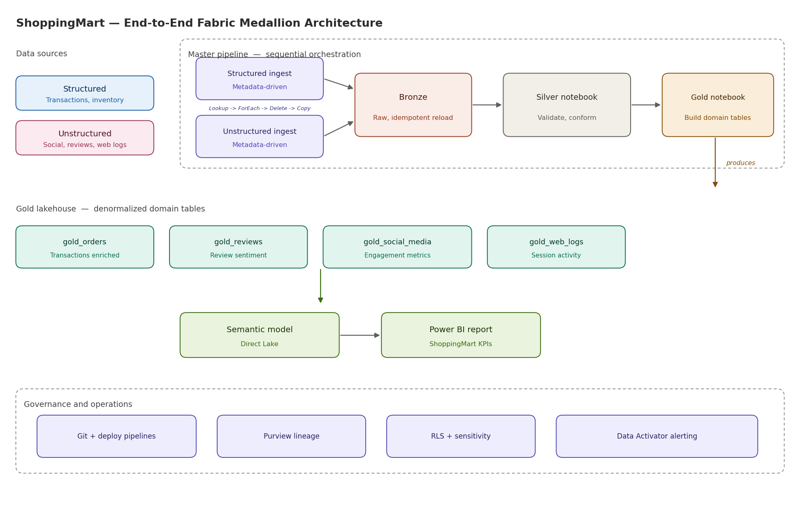
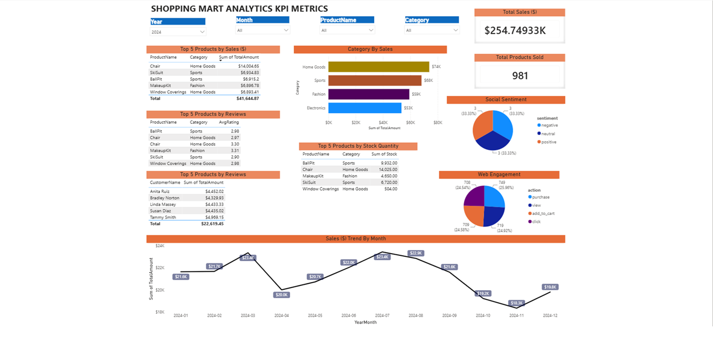

# End-to-End Fabric Medallion Pipeline — ShoppingMart Analytics

An end-to-end Microsoft Fabric data platform for "ShoppingMart", a mid-sized e-commerce retailer, that unifies structured and unstructured data into a single governed analytics solution. It ingests raw source data, refines it through Bronze, Silver, and Gold lakehouse layers, models it as a star schema, and serves it through a Direct Lake semantic model and Power BI report — with Git-based CI/CD, lineage, and row-level security wrapped around it.

## Problem

ShoppingMart, a mid-sized retail business, is facing significant competition and needs deeper insight into customer behavior, sales trends, inventory management, online engagement, and product sentiment to grow revenue and improve customer satisfaction.

The challenge is that the data needed to answer these questions is split across two very different shapes: structured transactional and inventory data, and unstructured social media posts, online reviews, and web logs. This project unifies both into one analytics platform that delivers actionable insight and tracks key business KPIs.

## Architecture



A master pipeline orchestrates the full flow in sequence: two metadata-driven ingestion sub-pipelines land raw data in Bronze, then two notebooks build the Silver and Gold layers. A governance and operations band applies across every stage.

| Stage | Component | What it does |
|-------|-----------|--------------|
| Orchestrate | Master pipeline (Invoke Pipeline + Notebook activities) | Runs structured ingest → unstructured ingest → Silver notebook → Gold notebook in sequence |
| Ingest | Two metadata-driven sub-pipelines (Lookup → ForEach → Delete → Copy) | A Lookup reads a metadata config table; a ForEach iterates each source, truncating then loading into Bronze |
| Bronze | Fabric Lakehouse | Stores raw, as-ingested data with no transformation — full replayability |
| Silver | PySpark Notebook → Lakehouse | Deduplicates, enforces schema, conforms types, validates |
| Gold | PySpark Notebook → Lakehouse | Builds the star schema (`dim_customers`, `dim_products`, `fact_sales`) |
| Serve | Direct Lake semantic model | Queries Gold Delta tables directly — no import, no refresh lag |
| Consume | Power BI report | RLS-secured report with Data Activator threshold alerting |

### Metadata-driven ingestion

Ingestion is config-driven, not hardcoded. Each sub-pipeline runs a `Lookup` against a metadata table that lists the sources to load, then a `ForEach` iterates that list. Inside each iteration, a `Delete` activity truncates the target before a `Copy` activity loads the source — a truncate-and-load pattern that makes every run idempotent, so re-running never duplicates data. Adding a new source is a row insert in the metadata table, not a pipeline change.

Structured and unstructured sources each get their own sub-pipeline following this identical pattern:

- **Structured** — transactional and inventory data
- **Unstructured** — social media, online reviews, and web logs

## Tech stack

`Microsoft Fabric` · `Lakehouse` · `Delta Lake` · `PySpark` · `Dataflow Gen2` · `Direct Lake` · `Power BI` · `DAX` · `Azure DevOps` · `Microsoft Purview`

## Layer walkthrough

### Bronze — metadata-driven raw landing
Two sub-pipelines land data untouched into Bronze: one for structured sources (transactions, inventory) and one for unstructured sources (social media, reviews, web logs). Each is driven by a metadata table: a `Lookup` reads the source list, a `ForEach` iterates it, and per iteration a `Delete` truncates the target before a `Copy` reloads it. The result is a durable, replayable raw record where every run is idempotent.


### Silver — validated and conformed
A PySpark notebook deduplicates records, enforces an explicit schema, conforms data types, and applies validation rules. Bad records are quarantined rather than silently dropped.

```python
# Example: schema enforcement + dedup in Silver
from pyspark.sql import functions as F

bronze = spark.read.format("delta").load("Tables/bronze_source")

silver = (
    bronze
    .dropDuplicates(["business_key"])
    .withColumn("amount", F.col("amount").cast("decimal(18,2)"))
    .filter(F.col("business_key").isNotNull())
)

silver.write.format("delta").mode("overwrite").save("Tables/silver_validated")
```

### Gold — dimensional model
A second notebook builds a classic star schema: two conformed dimensions (`dim_customers`, `dim_products`) surrounding a `fact_sales` grain. This is the layer the semantic model binds to.


### Serve — Direct Lake semantic model
The semantic model uses Direct Lake mode, querying the Gold Delta tables directly. This avoids an import refresh entirely — report data is current the moment the Gold layer updates — while keeping near-import query performance.

## Key engineering decisions

- **Metadata-driven ingestion over hardcoded pipelines** — sources are listed in a config table and iterated with a Lookup + ForEach, so onboarding a new source is a row insert, not a pipeline edit. One pipeline pattern scales to many sources.
- **Truncate-and-load (Delete before Copy)** — guarantees idempotency; re-running a load never produces duplicates, which matters for a metadata loop that may re-process the same source.
- **Direct Lake over Import** — eliminates refresh windows and memory duplication while keeping interactive query speed. Trade-off: requires the model to bind to Delta tables in a supported layout, which shaped the Gold table design.
- **PySpark transformations over Power Query / calculated columns** — heavy reshaping happens once, upstream, in Spark, so the semantic model stays thin and Direct Lake stays valid. Calculated columns that would break Direct Lake were refactored into the Gold notebook.
- **Medallion separation** — keeping raw, validated, and modeled data in distinct layers makes the pipeline debuggable and replayable; a bad Silver run never corrupts the raw record.
- **Star schema at Gold** — a dimensional model gives clean, performant DAX and intuitive slicing, versus reporting straight off normalized tables.

## Challenges solved

- **Unsupported calculated columns in Direct Lake** — calculated columns that aren't supported under Direct Lake were identified and refactored into PySpark transformations in the Gold layer, preserving the metric while keeping the model in Direct Lake mode.
- **Dangling DAX references** — measures pointing at columns removed during refactoring were traced and corrected using Tabular Editor before deployment.
- **Cross-stage binding limits** — semantic-model-to-lakehouse bindings that don't carry across deployment-pipeline stages were re-pointed via the XMLA endpoint with Tabular Editor.

## Governance and operations

- **CI/CD** — the workspace is connected to Git, with deployment pipelines promoting items across dev / test / prod stages via Azure DevOps.
- **Lineage** — Microsoft Purview provides end-to-end lineage and a data catalog across the layers.
- **Security** — row-level security on the semantic model; sensitivity labels applied to items.
- **Monitoring** — Data Activator watches Gold-layer thresholds and triggers alerts when metrics breach defined bounds.

## Results

- Unified five data sources spanning structured (transactions, inventory) and
  unstructured (social media, reviews, web logs) domains into a single governed
  Fabric platform.
- Metadata-driven ingestion onboards a new source as a config-table row insert,
  with zero pipeline code changes.
- One master pipeline run executes the full flow — dual-source ingestion,
  Silver validation, and Gold modeling — end to end with no manual steps.
- Gold layer serves  report-ready tables to a Direct Lake semantic model,
  giving refresh-free reporting that's current the moment Gold updates.
- Fully version-controlled and governed: Git-based CI/CD via deployment
  pipelines, row-level security, and Purview lineage across all layers.

## Repository structure

```
.
├── notebooks/
│   ├── NotebookGoldTransformation_ShoppingMart.ipynb
│   └── Notebook_SilverTransformation_ShoppingMart.ipynb
├── Data_pipelines/
│   ├── master_pipeline.json
│   ├── ingest_structured.json
│   └── ingest_unstructured.json
├── metadata/
│   └── source_config.json
├── semantic-model/
│   └── model.bim
├── docs/
│   └── architecture.png
└── README.md
```

## Final dashboard



[Live portfolio](https://bhavith-portfolio.vercel.app)